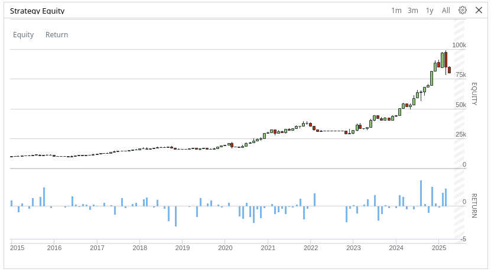

# 📈 Stock Index Top 10 Trend-Follow Strategy
[](https://www.quantconnect.com/)


This algorithm implements a **trend-following strategy** that selects the **top 10 companies** from a major stock index and rebalances the portfolio on a **weekly, monthly, or yearly** basis. The strategy is designed to maintain **equal-weight exposure** across selected stocks, aiming to capture momentum within leading market constituents.



> *Backtest Period: Jan 2015 – Feb 2025*  
> *(Using S&P500 MOMENTUM index with weekly rebalancing)*

| Metric                  | Value         |
|-------------------------|---------------|
| CAGR (Annual Return)    | 22.7%         |
| Max Drawdown            | -28.2%        |
| Sharpe Ratio            | 0.9           |
| Win Rate (Monthly)      | 55%           |
| Total Trades            | 4236          |

**Backtests last 10 years**
* [S&P 500 top 10 stocks](https://s3.amazonaws.com/reports.quantconnect.com/344866/24380342/692624d32b117a48857e6e209ede038b.pdf)
* [NASDAQ 100 top 10 stocks](https://s3.amazonaws.com/reports.quantconnect.com/344866/24380342/e9b4954f12329fd941d9a5f5fb3a5cf9.pdf)
* [S&P 500 momentum top 10 stocks](https://s3.amazonaws.com/reports.quantconnect.com/344866/24380342/738d2a888ec29b67afb1706a66689932.pdf)

## 🚀 Strategy Overview

- **Index Selection**: Choose from one of three predefined stock index lists:
  - `S&P500`
  - `NASDAQ100`
  - `S&P500 MOMENTUM` *(based on holdings of the SPMO ETF)*

- **Rebalancing Frequency**: Configurable via parameters:
  - `weekly`
  - `monthly`
  - `yearly`

- **Portfolio Construction**:
  - Equally weighted allocation across the top 10 stocks in the selected index.
  - Optional leverage (commented out in code) for more aggressive exposure.

## ⚙️ How It Works

- **Initialization**:
  - Loads the top 10 tickers from the selected index.
  - Sets a 10-year backtest period with $10,000 starting capital.
  - Adds daily resolution data for each stock.

- **Scheduled Rebalancing**:
  - Portfolio is rebalanced at the start of each week/month/year (based on user input).
  - All positions are liquidated before reallocation.
  - Equal weight is assigned to each stock.

## 🧠 Key Features

- Simple and transparent logic for trend-following exposure.
- Easy customization of index and rebalance frequency.
- Clean structure for backtesting and further development.

## 📊 Index Constituents

| Index Name         | Top 10 Holdings (as of sample date) |
|--------------------|--------------------------------------|
| S&P500             | NVDA, MSFT, AAPL, AMZN, META, AVGO, GOOGL, BRK.B, TSLA, GOOG |
| NASDAQ100          | NVDA, MSFT, AAPL, AMZN, AVGO, META, NFLX, TSLA, COST, GOOGL |
| S&P500 MOMENTUM    | NVDA, META, AMZN, AVGO, JPM, TSLA, WMT, NFLX, PLTR, COST |

> Source: [Yahoo Finance ETF Holdings](https://finance.yahoo.com/)

## 🛠️ Parameters

You can customize the strategy by setting the following parameters:

```python
index = self.get_parameter("index", "S&P500 MOMENTUM")
rebalancing_frequency = self.get_parameter("rebalancing_frequency", "weekly")
```

## How to Run in QuantConnect

1. **Create a New Project**:
   - Go to [QuantConnect](https://www.quantconnect.com/)
   - Click **"Create Project"** and name it (e.g., `Top10TrendFollow`)

2. **Paste the Code**:
   - Copy the strategy code into the `main.py` file

3. **Set Parameters** *(Optional)*:
   - In the **Parameters** tab, add:
     ```json
     {
       "index": "S&P500 MOMENTUM",
       "rebalancing_frequency": "monthly"
     }
     ```

4. **Run Backtest**:
   - Click **"Backtest"** to simulate performance over the last 10 years

5. **Review Results**:
   - Analyze charts, metrics, and trade logs to evaluate strategy behavior

## Notes

- The strategy uses **equal weighting** for simplicity and diversification.
- Leverage can be added by modifying the `set_holdings` line.
- No additional filters (e.g., technical indicators) are applied—this is a pure index-based trend-follow approach.
